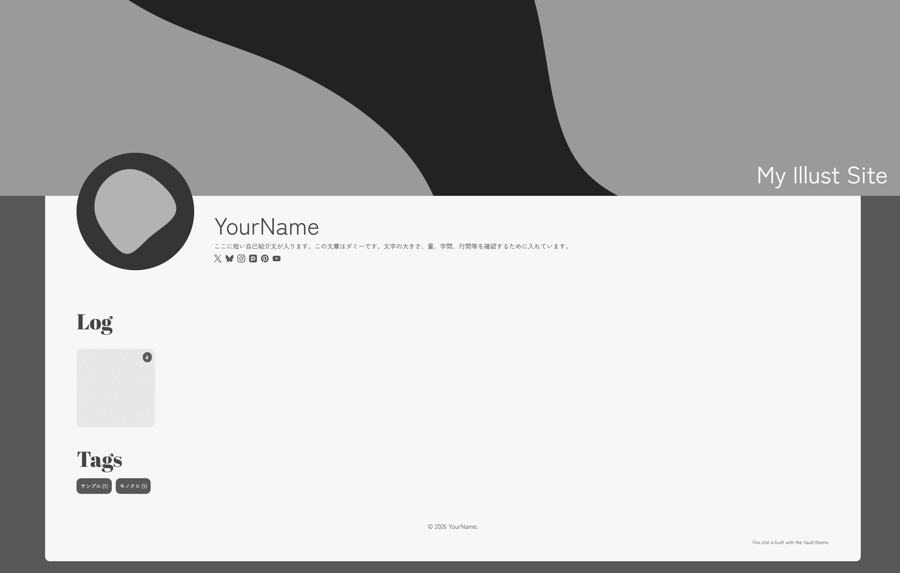
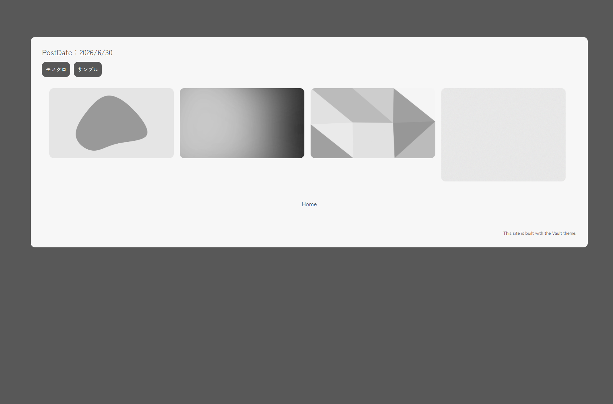

# Vault
### 🖼️ Astro製のイラスト作品の展示・ログ向けテーマ
Markdownファイルと画像を追加するだけで、作品ページを自動生成できます。
イラストの保管庫（Vault）のように、作品をシンプルにまとめられることを目指して開発しました。
[](https://nodejs.org/) [](https://astro.build/) 

[🖥️デモサイト](https://vault-livedemo.pages.dev/)


---
## コンセプト
Vault は、イラスト作品をシンプルに整理・公開するための Astro テーマです。
作品の追加は Markdown ファイルと画像を配置するだけ。作品管理に手間をかけず、創作そのものに集中できることを目指しています。

---

## ✨️ 特徴
- Astro Content Collections を利用した作品管理
- Markdown + 画像だけで作品ページを自動生成
- Masonryレイアウト
- PhotoSwipeによる画像拡大表示
- タグ機能
- コンフィグファイルによる簡単なサイト設定
- OGP対応

---

## 📦️ 動作環境
- Node.js　22以上
- Astro   7.x

---

## 🚀 インストール
```bash
git clone https://github.com/hilava999/vault.git

cd vault

npm install

npm run dev
```

---

## ⚙️ 初期設定
`src/config/siteConfig.ts` を編集してください。

設定できる項目

- サイトタイトル
- サイト説明
- テーマカラー
- ヘッダー画像
- アイコン画像
- プロフィール
- SNSリンク
- OGP画像
---
## 🖼️ 作品の追加方法

フォルダを `src/content/log` に作成し、作品を入れてください。

例

```text
src/content/log/

001/
├ index.md
├ image1.webp
├ image2.webp

002/
├ index.md
├ image.webp
```

各フォルダ内に `index.md` を作成し、作品情報を記述します。同じフォルダ内の画像は自動で取得され、ギャラリーとして表示されます。

`index.md`の記入例

```markdown
---
date: YYYY-MM-DD
cover: ./cover.png
tags: ["タグ1","タグ2"]
---
```

- date → 投稿日、必須
- cover → サムネイル画像の指定、必須
- tags → タグ、任意

---
## 📷️ スクリーンショット
### トップページ


### 作品ページ


---

## 📝 ライセンス
MIT License

### クレジットについて

トップページにクレジットを置いていますが、表示するか否かは任意です。デザイン上、邪魔に感じましたら削除しても構いません。削除する場合は、`/src/pages/index.astro`の以下のコードを削除してください。

```astro
<CreditLink />
```

---

## 🙏 使用ライブラリ
- Astro
- PhotoSwipe
- MiniMasonry
- Astro Icon

---

## 🐞 不具合・要望

不具合報告や機能要望は Issue よりお気軽にお知らせください。